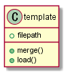

rockjs
=====
## Overview

## Description


## Usage

```js
template = require('common-module\template')
```

## Class Design

Template



## Installation
```
$ npm install
```

## Dependencies
package.json
```json
{
  "name": "rockjs",
  "version": "1.0.0",
  "description": "node modules wrapper functions",
  "main": "app.js",
  "scripts": {
    "test": "mocha ./test/*.test.js"
  },
  "keywords": [
    "common"
  ],
  "author": "sakai.mitsuru",
  "license": "MIT"
}
```
## Unit Test

```
$ mocha ./test/*.test.js
```
```
$ npm test
```

## LICENCE
MIT.
